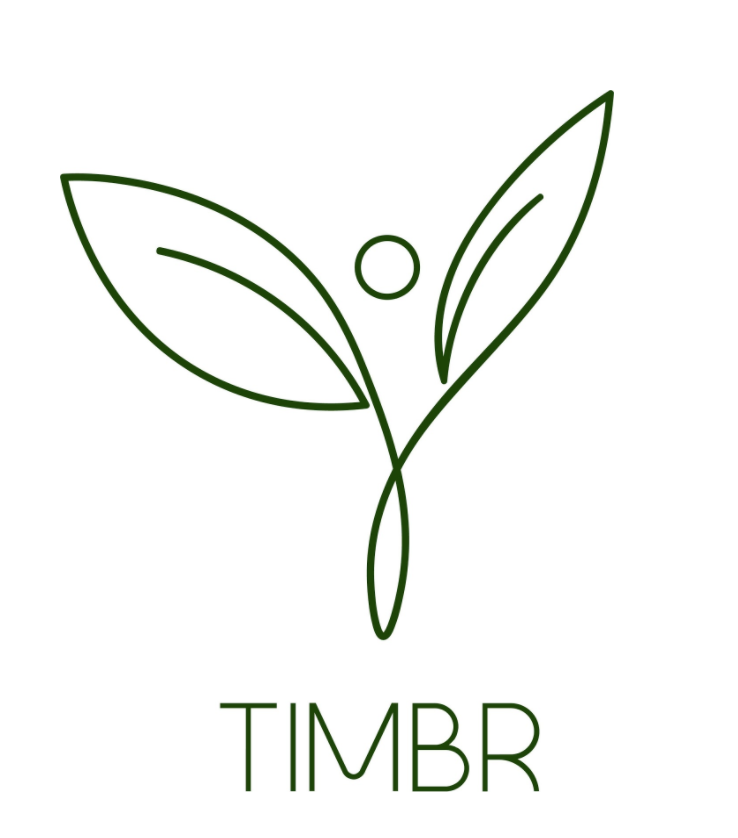

# timbr
Team 14, CS 407, Fall '20



## What is this?

timbr is a web application created to help amateur botanists learn how to take care of their plants, and to grow as a plant owner.

## Quickstart

To run the application locally, install and start Postgres and then run:

```bash
npm install
npm start-dev
```

The application will have started on `localhost:8080`.

## Testing

We've included unit and integration tests and linting as part of our application.

To run the tests, run:
```bash
npm run test
```

To lint, run:
```bash
npm run lint
npm run lint-fix # Fixes linting errors for you
```
